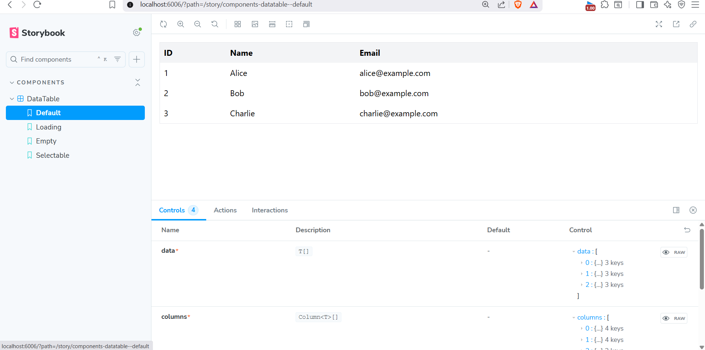
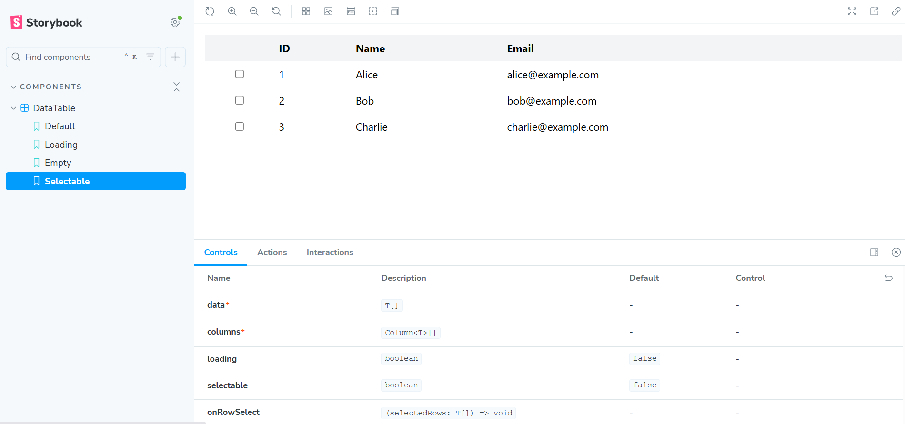
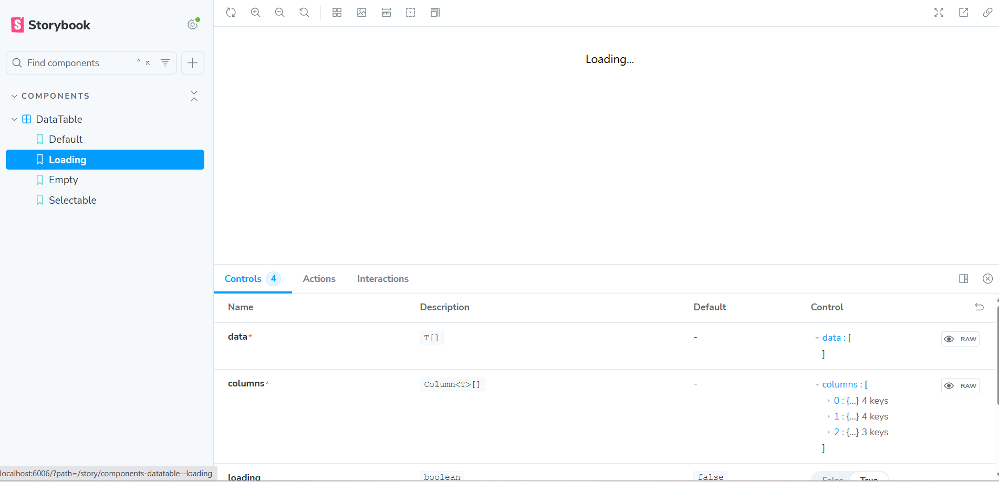

# 📊 DataTable Component - React + TypeScript + Tailwind + Storybook

This project is a reusable **DataTable component** built with React, TypeScript, TailwindCSS, and Storybook.  
It demonstrates key UI functionalities such as sorting, row selection, loading and empty states, with responsive and accessible design.

---

## 🚀 Features

- Display tabular data
- Column sorting (ascending/descending)
- Row selection (single/multiple)
- Loading state
- Empty state
- Responsive design
- Accessibility with ARIA labels
- Storybook integration for documentation
- Unit tests with Vitest & React Testing Library

---

## 📦 Installation

Clone the repository and install dependencies:

```bash

cd my-data-table
npm install
```

## 📚 Uses

The **DataTable component** can be used in any React project where you need to display structured data in a table format.

Typical use cases:

- 📊 **Admin dashboards** – to list users, orders, products, etc.
- 📦 **E-commerce applications** – show product catalogs or customer data
- 🏢 **Enterprise apps** – employee management systems, CRM, HR portals
- 📈 **Analytics dashboards** – display reports and sortable datasets
- ✅ **Reusable UI library** – use as a base component in multiple projects

This component provides:

- Sorting for better data exploration
- Row selection for bulk actions
- Loading/Empty states for better UX
- Responsive & accessible design

## 📷 Preview

Here is how the DataTable looks in Storybook:



Selectable Rows:  


Loading State:  

